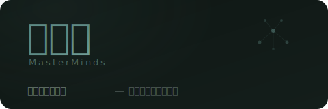

<p align="center">
  
</p>

<p align="center">
  <em>多智能体协作创意写作平台</em><br/>
  <sub>多个 AI agent 以圆桌讨论的形式，陪你从灵感到定稿，完成一部作品</sub>
</p>

<p align="center">
  
  
  
  
</p>

---

## 工作方式

每个创作阶段有一组专业 agent 围坐讨论：

| 阶段 | 圆桌成员 | 做什么 |
|------|---------|--------|
| **构思** | 灵犀 + 鲁班 | 打磨核心冲突、主题、logline |
| **世界与角色** | 画皮 + 灵犀 + 鲁班 | 角色档案、世界观、规则 |
| **结构** | 鲁班 + 妙笔 + 铁面 | 节拍表、章节大纲、张力曲线 |
| **写作** | 妙笔 + 铁面 | 逐章写作，多模型择优 |
| **审稿** | 铁面 + 知音 + 妙笔 | 多轮审稿，频率检查 |
| **定稿** | 知音 + 铁面 | 第一读者体验，最终打磨 |

你说一句话，圆桌上所有 agent 依次发言，然后**自动展开讨论**——互相点名回应、争论、补充，直到达成共识或你介入。阶段完成时 agent 会提醒你推进。每个阶段可以生成总结，新阶段不用把全部历史对话塞进 context。

## Agent

> 每个 agent 配备专属写作技能（对话潜台词、心理距离、场景张力等），从 markdown 技能文件加载。Agent 会从你的纠正中**自动学习**，内化到记忆里，下次不再犯同样的错。

| | 名号 | 角色 | 专长 |
|---|------|------|------|
| 💡 | **灵犀** | Idea | 点子发散与收敛 |
| 🏗 | **鲁班** | Architect | 故事结构与节奏 |
| 🎭 | **画皮** | Character | 角色心理与声音 |
| ✍ | **妙笔** | Writer | 文笔与场景 |
| 📝 | **铁面** | Editor | 批判审稿与质控 |
| 📖 | **知音** | Reader | 第一读者视角 |

### 反馈吸收

当你纠正某个 agent（比如"鲁班你要更有耐心"），系统自动：
1. 检测反馈针对哪个 agent
2. 提取可执行的学习点
3. 写入该 agent 的记忆（项目级 + 全局级）
4. 下次发言时自动生效

## 技术栈

- **Next.js** (App Router) + **Tailwind CSS v4**
- **Prisma** + **SQLite**
- **SSE** 流式响应
- 多模型支持：**Claude**、**GPT**、**DeepSeek**、**Gemini**

## 启动

```bash
pnpm install
cp .env.example .env
# 在 .env 中填入 API key

pnpm prisma db push
pnpm dev
```

## 功能

- **圆桌讨论** — 每条消息多个 agent 轮流回应，然后自动讨论 1-2 轮
- **反馈吸收** — 你的纠正自动提取并写入 agent 记忆（项目级 + 全局级）
- **文件附件** — 拖拽或点击 📎 附加文本文件，内容随消息一起发送
- **阶段推进** — agent 判断时机，建议进入下一阶段
- **阶段总结** — LLM 生成详细总结，新阶段用总结代替全量历史
- **修稿循环** — 写作/审稿阶段：铁面审稿→你注入意见→妙笔修改→循环直到 PASS
- **修稿反思** — 每轮修稿后铁面输出反思备忘录，避免重复犯错
- **Markdown 导入/导出** — 保存和加载对话记录
- **剪贴板** — 随手收藏 agent 的精彩片段
- **多模型切换** — Claude / GPT / DeepSeek / Gemini 随时切换

## 项目结构

```
src/
  app/
    api/
      chat/          — 消息 CRUD + 流式输出
      agent-notes/   — 反馈吸收 API
      projects/      — 项目管理
      phases/        — 阶段总结生成
      clips/         — 剪贴板
    project/[slug]/  — 主聊天界面
  lib/
    agents/
      context.ts     — 构建 agent 上下文（技能、记忆、阶段总结）
      roles.ts       — 加载角色定义
    llm.ts           — 多模型 LLM 客户端（Claude / GPT / DeepSeek / Gemini）
    db.ts            — Prisma 客户端
    project.ts       — 项目 CRUD
agents/
  roles/             — agent 角色定义（markdown）
  skills/            — 写作技能参考（markdown）
  frameworks/        — 写作框架 + 风格参考 + 评分锚定
  checklists/        — 质量检查清单（反AI味、自检）
data/
  [slug]/memory/
    agent-notes/     — 每个 agent 从反馈中学到的经验
    project-memory.md
    style-guide.md
  global-agent-notes/ — 跨项目的 agent 全局经验
```

## License

MIT
